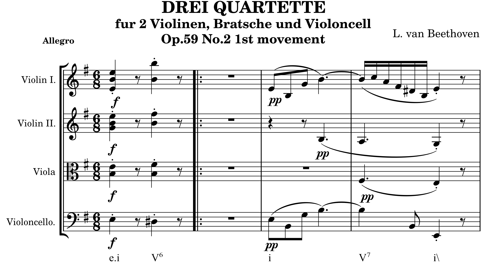

============
DCML Corpora
============

What is this?
=============

This is a meta-repository containing all corpora published and curated by the `Digital and Cognitive Musicology Lab Lausanne <https://www.epfl.ch/labs/dcml/>`__. Currently, only one corpus (the Annotated Beethoven Corpus, ABC) is publicly available, but more are to follow in 2021.

What do the corpora include?
============================

At the heart of every subcorpus is a folder called ``MS3`` containing a set of annotated music scores in the MuseScore file format ``.mscx``. In order to display the files you need to `download the data <#downloading-the-data>`_ to your computer and open them with `MuseScore 3 <https://musescore.org/download>`__. For example, the beginning of the file ``ABC/MS3/n08op59-2_01.mscx`` looks like this:

    *Beginning of Beethoven's 8th String Quartet op. 59/2 with harmony labels*

In addition to the annotated scores in the ``MS3`` folder, the following folders contain the same information in a tabular format:

* **notes**: TSV files representing one note per row
* **measures**: TSV files representing one measure per row
* **harmonies**: TSV files representing one harmony label per row

The `TSV files <https://en.wikipedia.org/wiki/Tab-separated_values>`__ (tab-separated values) can be opened with any modern data processor, programming language, or spreadsheet, for example with `LibreOffice Calc <https://www.libreoffice.org/discover/calc/>`__. They were created with the MuseScore parser `ms3 <https://github.com/johentsch/ms3>`__ which can be used to extract other information from MuseScore files, too, such as articulation, lyrics, or rests.

Harmony Labels
--------------

The harmonic analysis in the above example follows the `DCML harmonic annotation standard <https://github.com/DCMLab/standards>`__. The labels were entered into the scores by professional music theorists.

Downloading the data
====================

This repository contains submodules. You can use this command to clone it

``git clone --recurse-submodules -j8 https://github.com/DCMLab/dcml_corpora.git``

``-j8`` is available from git >= 2.8 and fetches up to 8 submodules at a time in parallel.
